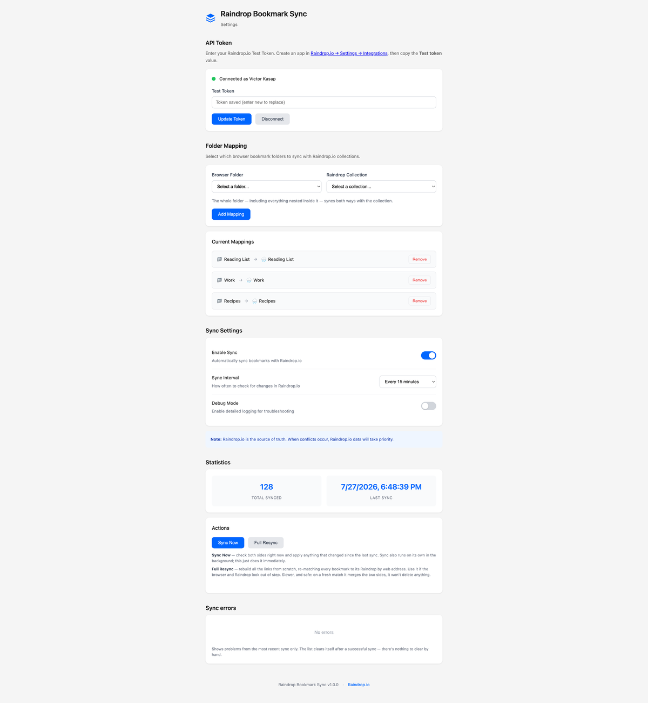
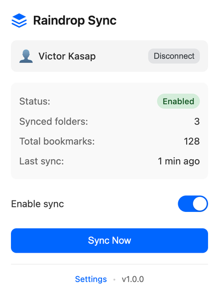

# Raindrop Bookmark Sync

Two-way bookmark synchronization between Firefox/Chrome and [Raindrop.io](https://raindrop.io).

## Features

- **Two-way sync** - Changes in browser sync to Raindrop.io and vice versa
- **Folder mapping** - Choose which bookmark folders sync with which Raindrop collections
- **Nested folders** - Full support for folder hierarchies
- **Real-time sync** - Bookmark changes sync immediately
- **Periodic sync** - Configurable interval (1-60 minutes) to pull changes from Raindrop.io
- **Cross-browser** - Works in Firefox (Manifest V2) and Chrome (Manifest V3)

## Screenshots

<p align="left">
  
  
</p>

The settings page manages the connection, folder ↔ collection mappings, sync interval,
statistics, and a live panel of any errors from the last sync. The toolbar popup gives an
at-a-glance status with a one-click **Sync Now**.

## Installation

### From Browser Stores

- **Firefox**: [Raindrop Bookmark Sync on Add-ons for Firefox](https://addons.mozilla.org/en-US/firefox/addon/raindrop-bookmark-sync)
- **Chrome**: [Raindrop Bookmark Sync on the Chrome Web Store](https://chromewebstore.google.com/detail/hjknhomjjhmjokbdkhmbgppgjjljjddn)

### Manual Installation (Development)

1. Clone this repository
2. Install dependencies:
   ```bash
   npm install
   ```
3. Build the extension:
   ```bash
   npm run build:firefox   # For Firefox
   npm run build:chrome    # For Chrome
   ```
4. Load the extension:
   - **Firefox**: `about:debugging` > This Firefox > Load Temporary Add-on > select `dist/firefox/manifest.json`
   - **Chrome**: `chrome://extensions` > Developer mode > Load unpacked > select `dist/chrome/`

## Setup

1. Get a Test Token from Raindrop.io:
   - Go to [Raindrop.io Settings > Integrations](https://app.raindrop.io/settings/integrations)
   - Create a new app (or use existing)
   - Copy the **Test token**

2. Configure the extension:
   - Click the extension icon > Open Settings
   - Paste your Test Token and click **Save & Connect**

3. Create folder mappings:
   - Select a bookmark folder and a Raindrop.io collection
   - Click **Add Mapping**
   - Bookmarks will sync automatically

## How It Works

- Changes in mapped bookmark folders are reconciled to Raindrop.io within about
  a second of the change (a short debounce collapses bursts into one pass).
- Changes in Raindrop.io are picked up periodically (configurable interval), and
  the same periodic pass catches up anything a real-time trigger missed.
- Both directions run through **one three-way reconcile** — see below.

## How sync resolves conflicts

Sync is a three-way merge: for every bookmark and folder the extension keeps a
baseline (the state after the last successful sync) and compares both sides
against it.

- Changed only in the browser → pushed to Raindrop.
- Changed only in Raindrop → pulled into the browser.
- **Changed on both sides → Raindrop wins.** The browser copy is overwritten.
- Deleted on one side (and untouched on the other) → the deletion propagates.
  Raindrop-side deletions of bookmarks go to Raindrop's Trash and can be
  restored there.
- **Deleted in the browser but edited in Raindrop → the bookmark comes back.**
  An edit in Raindrop outranks a browser-side delete (Raindrop wins).
- When a folder is first mapped to a non-empty collection, the two sides are
  **merged** (union) — mapping never deletes anything that existed before the
  first sync.

### Nested folders: behavior and limitations

Connecting a folder syncs the **whole subtree** — the folder and everything
nested inside it — with the collection, in both directions. There is no
opt-out: new subfolders become collections and new child collections become
subfolders automatically. Nested subfolders are managed for you and are not
listed separately in Current Mappings.

- **Deletes are two-way and cascade.** Deleting a folder or collection on
  either side removes its counterpart and all descendants (raindrops go to
  Raindrop's Trash, recoverable). To stop syncing a folder tree *without*
  deleting anything, use **Remove** on its mapping — that only disables sync.
- **Renames are two-way.** Rename a mapped folder in the browser and its
  collection is renamed to match; rename the collection in Raindrop and the
  browser folder follows. If both are renamed before a sync, Raindrop wins.
- **Sibling folders with identical names** cannot be told apart during the
  first-time match and may pair up arbitrarily. Once paired, the link is
  stable.

## Development

```bash
npm install              # Install dependencies
npm run watch:firefox    # Watch mode for Firefox
npm run watch:chrome     # Watch mode for Chrome
npm run start:firefox    # Run Firefox with extension
npm run start:chrome     # Run Chrome with extension
npm run build:all        # Build for both browsers
npm run lint             # Lint extension
npm run package:all      # Package for store submission
```

## Permissions

- `bookmarks` - Read and modify bookmarks
- `storage` - Store settings and sync data locally
- `alarms` - Schedule periodic sync
- `https://api.raindrop.io/*` - Communicate with Raindrop.io API

## Privacy

This extension does not collect any personal data. All data is stored locally on your device.

See [Privacy Policy](PRIVACY_POLICY.md) for details.

## Support

If you encounter issues or have questions:
- [Open an issue](https://github.com/victorkasap/raindrop-bookmark-sync/issues)

## License

MIT License - see [LICENSE](LICENSE) for details.
